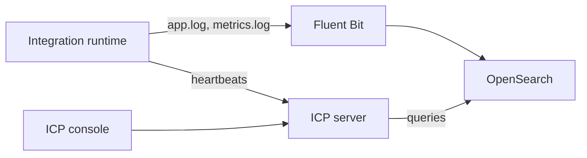

# ICP Observability Setup

When your integrations run on your own infrastructure, the [Integration Control Plane](../icp/index.md) (ICP) can show their logs and metrics in one console, alongside health and runtime status. ICP reads this data from OpenSearch, which is populated by Fluent Bit tailing the runtime's log files.

Setting this up involves four steps:

1. Deploy OpenSearch.
2. Create the index templates for logs and metrics.
3. Configure the integration to write structured logs and metrics.
4. Set up Fluent Bit to ship the logs to OpenSearch.

:::info Complete guide
The full step-by-step procedure, including commands and configuration, is in [Observability setup](../icp/observability-setup.md) in the Integration Control Plane section.
:::

## Related

- [Logging](logging.md), [Metrics](metrics.md), and [Distributed Tracing](tracing.md) — instrument the integration itself.
- [OpenSearch](open-source/opensearch.md) — use OpenSearch as a general-purpose log analytics backend.
- [Connect an integration to ICP](../icp/connect-runtime.md) — a prerequisite for viewing data in the console.
